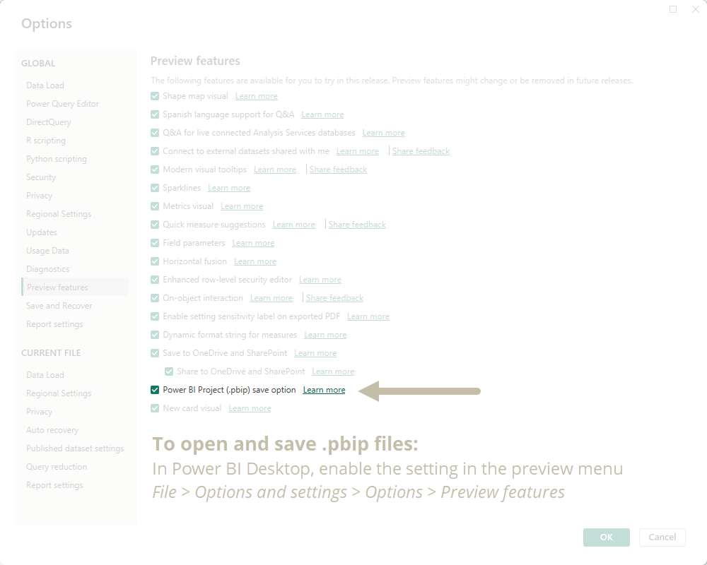

# powerbi-macguyver-toolbox
Power BI report .pbip templates and patterns to create special visuals, address specific problems, and have data adventures.

## ⚠️ Notice
These templates are provided as-is without warranties or guarantees. They are not maintained nor are they all necessarily suitable for use in production solutions.
Feel free to use them, but do so at your own risk.
	
## ⚠️ To use these templates
You must first enable Power BI Project files from Power BI Desktop to open and use these templates. Note that the .pbip format is in Preview.

1. Open Power BI Desktop (~May 2023 version or later)
2. Open the 'File' menu
3. Navigate to _Options and settings_ and then _Options_
4. Enable the preview feature _Power BI Project (.pbip) save option
5. Restart Power BI Desktop
6. Clone the Repo to your local machine using VS Code or a similar SCM tool
7. Open the .pbip files in Power BI Desktop

__I use the .pbip format for the following reasons:__
- Lightweight sharing of report + model metadata.
- Report metadata allows you to programmatically modify the templates before opening them.
- Track changes of the individual objects and formatting in the GitHub repo.

## Bar chart templates
The following bar chart templates are available:

(Table with links WIP)